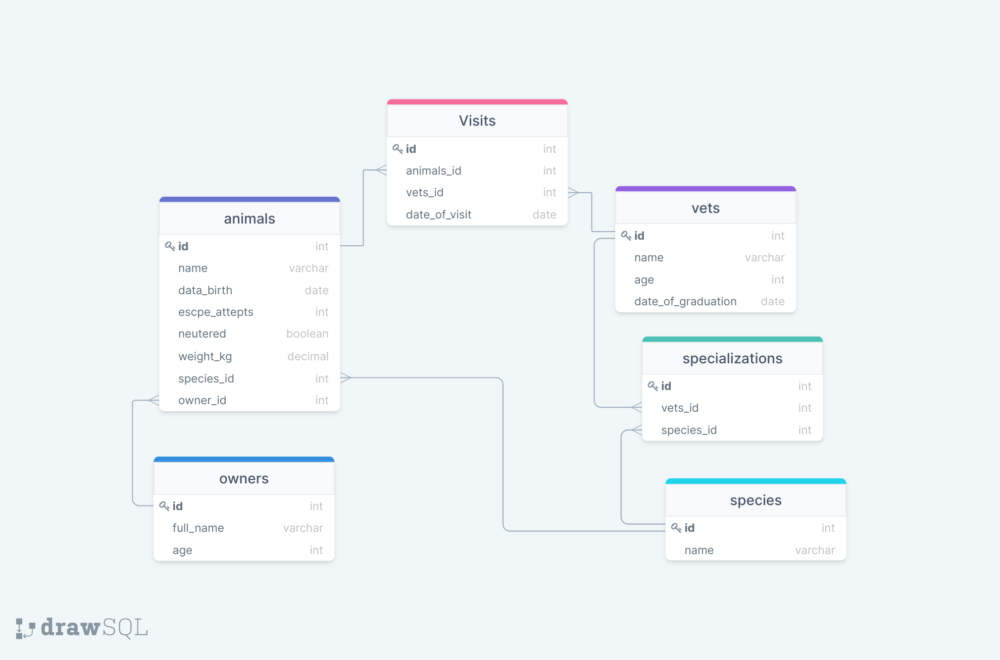

# VET-CLINIC-DATABASE

> Database for a vet clinic with data about the animals.

## Schema Diagram

## Getting Started

This repository includes files with plain SQL that can be used to recreate a database:

- [schema.sql](./schema.sql) contains all tables.
- [data.sql](./data.sql) contains sample data used to populate the tables.
- Check [queries.sql](./queries.sql) for examples of queries that can be run on a newly created database. **Important note: this file might include queries that make changes in the database (e.g., remove records). Use them responsibly!**

## Authors

👤 **Author1**

- GitHub: [@carlylechia](https://github.com/carlylechia)
- Twitter: [@chiacarlyle](https://twitter.com/chiacarlyle)
- LinkedIn: [chia-carlyle](https://linkedin.com/in/chia-carlyle)

👤 **Author2**

- GitHub: [@ Bahadur](https://github.com/samiullahbahadur)
- Twitter: [@Bahadur](https://twitter.com/Samiull88496331)
- LinkedIn: [Bahadur](https://www.linkedin.com/in/jsivahera/)

## 🤝 Contributing

Contributions, issues, and feature requests are welcome!

Feel free to check the [issues page](../../issues/).

## Show your support

Give a ⭐️ if you like this project!

## Acknowledgments

- Hat tip to the Microverse community, @microverseinc for their tutorship and supervision.

## 📝 License

This project is [MIT](./MIT.md) licensed.
